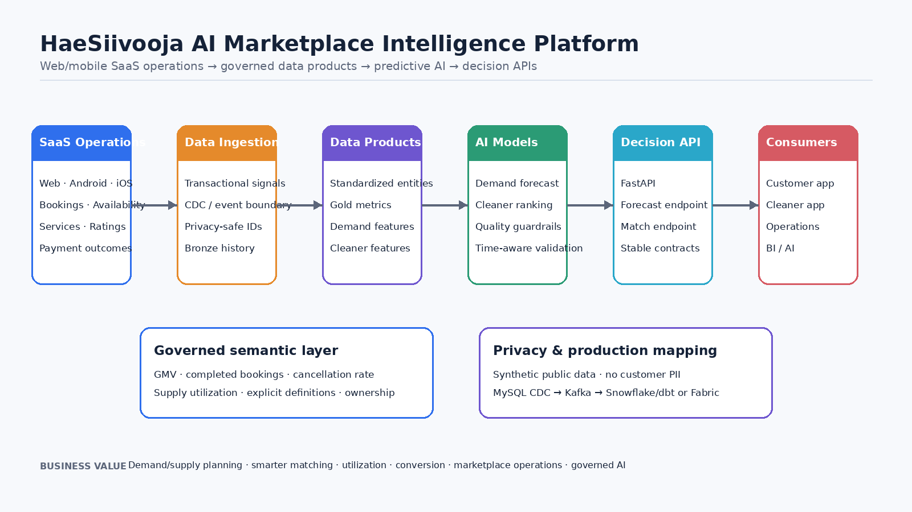

# HaeSiivooja Real-Time Marketplace Intelligence & AI Decision Platform

A production-oriented **data engineering + applied AI architecture** built around the operating model of HaeSiivooja, a web and mobile cleaning-services SaaS marketplace. The platform connects marketplace events to governed data products, predictive models, decision recommendations and controlled operational actions.

> The public implementation uses deterministic synthetic/anonymized marketplace data. It contains no customer PII, exact addresses, Stripe identifiers, payment credentials or production records.



## Summary

A two-sided marketplace must continuously balance **customer demand, cleaner supply, availability, price, quality, location and service compatibility**. Reporting alone is not enough: operational value comes from detecting changing conditions, predicting what happens next, recommending an appropriate intervention and measuring the outcome.

This case therefore uses a closed-loop architecture:

**Observe → Predict → Recommend → Approve → Act → Measure → Improve**

The repository combines a reproducible public implementation with a production real-time architecture that maps HaeSiivooja SaaS events to **MySQL CDC, Debezium, Kafka, Bronze/Silver/Gold data products, governed metrics, ML models, decision APIs and outcome feedback**.

## Implemented in this repository

- deterministic synthetic marketplace data modeled on HaeSiivooja business entities
- demand and cleaner feature pipelines
- gradient-boosted demand forecasting with chronological holdout validation
- cleaner match ranking with quality guardrails
- governed semantic metric contracts
- FastAPI forecast and matching endpoints
- marketplace supply-demand decision endpoint
- recommendation-only operational actions with explicit human-approval flags
- automated feature and decision tests
- CI validation
- reproducible colored architecture generation

## Real-time production design

The production extension captures operational changes from HaeSiivooja rather than relying on periodic extracts:

**Web / Android / iOS SaaS → MySQL → Debezium CDC → Kafka → Bronze event history → Silver marketplace model → Gold metrics & features → ML models → semantic/governance layer → AI decision service → policy & human approval → action APIs → applications**

Outcome events such as conversions, accepted availability, completed bookings, cancellations and quality signals flow back into the platform so decisions can be evaluated and improved.

The same governed data layers can be implemented with either **Snowflake/dbt** or **Microsoft Fabric / OneLake / Lakehouse**.

## Marketplace decisions

The decision layer combines demand forecasts with supply/capacity signals and returns explicit recommendations rather than silently changing the marketplace.

Example actions include:

- availability campaigns when forecast demand exceeds cleaner capacity
- wider matching-radius evaluation when local supply is insufficient
- incentive simulation for material shortages
- cleaner matching optimization
- no-intervention decisions when capacity already covers forecast demand

The public endpoint operates in **recommendation-only mode**. Financial or customer-impacting actions require a separate policy/approval boundary.

## API

- `GET /health`
- `POST /api/v1/demand-forecast`
- `POST /api/v1/match`
- `POST /api/v1/marketplace-decision`

The API keeps predictive and decision logic behind stable service contracts so models and policies can evolve independently from the web, Android and iOS applications.

## Governed data products

### Marketplace demand features
Daily city/service grain with booking volume, completions, cancellations, booked minutes, gross marketplace value, calendar features and cancellation rate.

### Cleaner features
Per-cleaner quality and capacity signals including rating, reliability, historical completion rate, booked minutes, utilization proxy, relative price and marketplace value.

### Semantic metric contracts
Machine-readable definitions for Booking GMV, Completed Bookings, Cancellation Rate and Supply Utilization, including grain and ownership.

## AI capabilities

### Demand forecasting
A gradient-boosted regression pipeline predicts booking demand by city, service and calendar context. Validation uses a chronological holdout to avoid future-to-past leakage.

### Cleaner ranking
A gradient-boosted classifier ranks already-eligible cleaners using distance, relative price, rating, reliability, completion history and utilization. Availability and service compatibility remain deterministic business constraints.

### Decision intelligence
Forecasts and supply signals are translated into explainable recommended actions. The public implementation does not autonomously execute campaigns, change pricing or move money.

## Real-time event contracts

The repository includes a Debezium CDC connector example and a versioned booking-event JSON Schema under `streaming/` and `events/`. These artifacts show how operational database changes can enter Kafka with explicit contracts before downstream transformation.

## Observability & reliability

A production deployment should monitor:

- event freshness and consumer lag
- schema compatibility
- pipeline and model failures
- data-quality rules
- feature freshness
- forecast/ranking drift
- decision outcomes
- lineage from source event to recommendation

## Privacy & governance

- no public production identities or payment identifiers
- pseudonymous analytical identifiers
- city-level public geography
- explicit metric ownership
- separation of predictive recommendations from action authorization
- GDPR retention/access controls in production
- auditable decision and approval events

## Run locally

```bash
python -m pip install -r requirements.txt
make all
uvicorn api.main:app --reload
```

## Repository structure

```text
api/          FastAPI prediction and decision services
artifacts/    Synthetic model-validation outputs
docs/         Architecture documentation and generated diagram
events/       Versioned event contracts
ml/           Forecasting and ranking training
semantic/     Governed marketplace metric contracts
src/          Synthetic data and feature pipelines
streaming/    CDC / Kafka integration design
tests/        Feature and decision tests
```

**Technologies:** Python · Pandas · scikit-learn · FastAPI · Pydantic · MySQL · Debezium CDC · Apache Kafka · Bronze/Silver/Gold architecture · feature engineering · demand forecasting · ranking · decision intelligence · semantic metrics · CI/CD · Snowflake/dbt · Microsoft Fabric/OneLake
